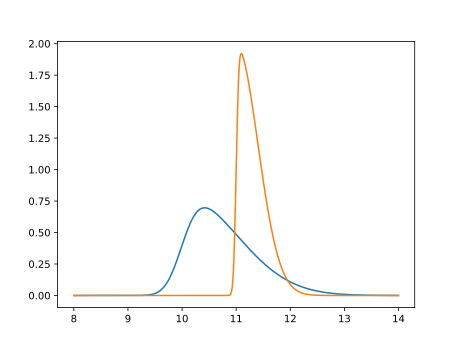
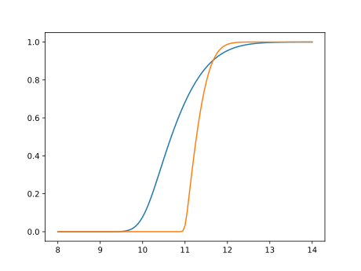

Demonstration of Delays in 2-D Computing Grid
=============================================

This is a simulation of the progress made in a 2-D computation grid.
In such a grid the computations are done in (time) steps.  Before the
next step can be started all neighboring nodes (eight in this case,
except on the edges) must have finished the previous round.  This is
in many computations necessary to exchange information about the
results of the finished step so that non-local data can be taken into
account during the computation of the next step.

One example would be the computation of trajectories of objects with
mass.  In theory every object has an effect on any other object but
this would slow down the computation tremendously.  Instead, as an
approximation only the objects in the vacinity are taken into account.

If each node performs the computation for some part of space (2D, 3D,
or whatever) then only masses in the neighboring nodes need to be know.
This can be mapped nicely to a grid as in this example.

Animate
-------

The python program creates SVG files as output.  These can be looked at
with `eog` or similar tools in sequence.  Or: one can create an animated
GIF:

    convert -delay 40 -loop 1 gen-t????.svg gird-movie.gif

Implementation Details
----------------------

The Python code simulates progress (e.g., of computation) on a 2×2 grid.
Each cell is computed independently with its on random latency.  The
next step is started only when all, along the rules spelled out above,
all eight neighbors also finished working on the current step.

The simulation progresses linearly over time.  How long each time step for
each cell takes is determined at the beginning of each timestep by sampling
from one of two used random number distributions.  The distributions are
[skewed normal distributions](https://en.wikipedia.org/wiki/Skew_normal_distribution)
which are more realistic for delays than are normally distributed delays:
there is an absolute minimum of time a task needs to finish but depending on
the compute environment delays might be long.  The PDFs of the distributions
used by default are:

This results in the folling CDFs:

As can be seen, the one distribution's (in blue) mode has a significantly lower
value than the one of the other distribution (in orange).  A skewed normal distribution
is characterized by the location, scale, and shape which are 10/4/1 and 11/10/0.4,
respectively.  Looking at the PDFs one sees a much higher probability for a short
time needed to finish the step (the sampled random number represents the number
of time steps needed) but the CDFs reveal that the blue distribution has a fatter
tail, even if the difference is quite small.

Results of the Example
----------------------

When the script is run using the default parameters the created graphics when
combined into an animation can be seen below.

The grid on the left hand side is using for each computation step the blue
distribution with the smaller mode.  The grid on the right hand side is using the
other distribution.

The dot representing each grid point is color coded according to the number of
time steps the computation of that grid point is behind that of the most progressed
grid point.  The color is darker the further behind the computations at that grid
point are.  Because any grid point's computation only holds back it's immediate
neighbors it does not mean all grid points' computations are equally held back.
To the contrary, as the progressing animation shows.

The numbers at the bottom of each grid shows statistics of the generations of
computations (i.e., how many times the computation at a grid point finished).

At first side we can see the computations on the grid on the right are progressing
smoother, with less variation (not as many darker dots.)  Second, even the statistics
of the generations show better results.  The slowest grid point of the right grid progressed
almost as far as the fastest grid point on the left (58 vs 60) and the fastest grid point
on the right is siginificantly ahead of the fastest grid point on the left (64 vs 60).
The spread on the right is also smaller.

Looking at the PDFs and CDFs above such a large difference might be surprising
(and is the reason for this demo).  The mode of the distribution for the left grid
is significantly lower than that of the distribution for the right grid.  What makes
the difference are the outliers.

What To Learn From This
-----------------------

Raw performance is not the ultimate means to achieve high-performing programs.  Outside
influences such as the need for synchronization and data exchange might benefit
significantly from having more predictable workloads.